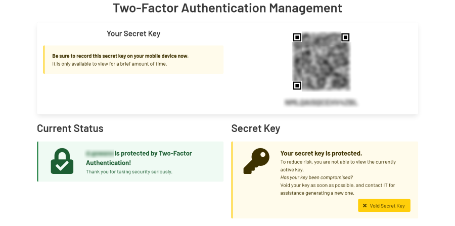

# Two-Factor Authentication Management Server

  

A server for users to initialize their secret two-factor authentication keys.

## Features

-   User manages their own secret keys.
-   Industry standard TOTP keys.

## Authenticator Apps

The server generates secret keys and corresponding QR codes
compatible with popular authenticator apps.

### Microsoft Authenticator

-   [Microsoft Authenticator on Google Play](https://play.google.com/store/apps/details?id=com.azure.authenticator)
-   [Microsoft Authenticator on Apple App Store](https://apps.apple.com/ca/app/microsoft-authenticator/id983156458)

### Google Authenticator

-   [Google Authenticator on Google Play](https://play.google.com/store/apps/details?id=com.google.android.apps.authenticator2)
-   [Google Authenticator on Apple App Store](https://apps.apple.com/ca/app/google-authenticator/id388497605)

## Need to Validate Tokens in Your Application?

There are many libraries that can be used to validate TOTP tokens.

If your application is implemented in Node.js,
[otplib](https://www.npmjs.com/package/otplib) is a fantastic choice!
